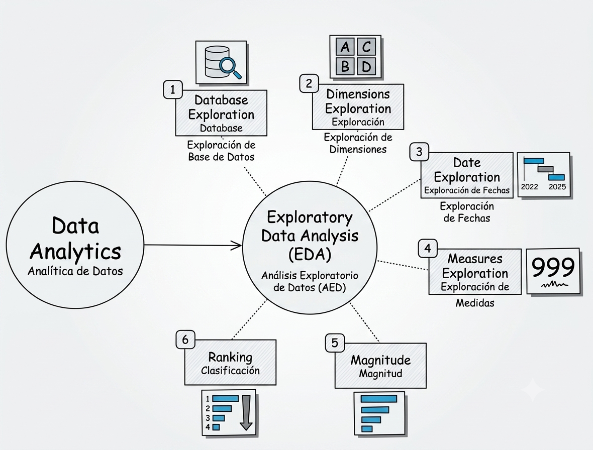

# Análisis Exploratorio de Datos (EDA)

  

## Descripción General

Esta carpeta contiene los scripts SQL utilizados para realizar un Análisis Exploratorio de Datos (EDA) sobre la capa Gold del Data Warehouse.

El objetivo de esta etapa es comprender la estructura, calidad, distribución y comportamiento del negocio antes de construir dashboards o aplicar técnicas de analítica avanzada.

---

# Objetivos

- Explorar los objetos y metadatos de la base de datos.
- Comprender la estructura del modelo analítico.
- Identificar Dimensiones y Medidas.
- Calcular los principales indicadores del negocio (KPIs).
- Analizar la distribución y magnitud de los datos.
- Descubrir patrones de comportamiento del negocio.
- Preparar un conjunto de datos confiable para Business Intelligence y Analítica Avanzada.

---

# Secciones del Análisis

## 1. Exploración de la Base de Datos

Inspeccionar la estructura y los metadatos de la base de datos.

**Temas analizados:**

- Esquemas
- Tablas
- Vistas
- Columnas
- Tipos de datos

---

## 2. Exploración de Dimensiones

Analizar los atributos categóricos utilizados para segmentar la información del negocio.

**Ejemplos:**

- País
- Género
- Estado Civil
- Categoría de Producto
- Subcategoría de Producto

---

## 3. Exploración de Fechas

Comprender la información histórica disponible.

**Ejemplos:**

- Primera fecha de venta
- Última fecha de venta
- Rango histórico de ventas
- Cliente más joven
- Cliente de mayor edad

---

## 4. Exploración de Medidas

Calcular los principales indicadores del negocio.

**Ejemplos:**

- Ventas Totales
- Total de Pedidos
- Total de Clientes
- Total de Productos
- Cantidad Total Vendida
- Precio Promedio de Venta

---

## 5. Análisis de Magnitud

Medir la distribución y el tamaño del negocio a través de distintas dimensiones.

**Ejemplos:**

- Clientes por País
- Clientes por Género
- Productos por Categoría
- Ingresos por Categoría
- Ingresos por Cliente
- Productos Vendidos por País

---

## 6. Análisis de Rankings

Identificar el mejor y peor desempeño del negocio.

**Ejemplos:**

- Top 5 Productos por Ingresos
- Bottom 5 Productos por Ingresos

---

# Tecnologías

- PostgreSQL
- SQL
- Data Warehouse
- Modelo Estrella (Star Schema)
- Análisis Exploratorio de Datos (EDA)

---

# Habilidades Demostradas

- Consultas SQL
- Exploración de Datos
- Análisis de KPIs
- Perfilado de Datos
- Análisis de Rankings
- Análisis de Magnitud
- Analítica Orientada al Negocio

---

# Próxima Etapa

La siguiente fase del proyecto estará enfocada en transformar los datos analizados en información de valor mediante:

- Análisis Estadístico
- Segmentación de Clientes
- Series Temporales
- Analítica Avanzada
- Dashboards de Business Intelligence
