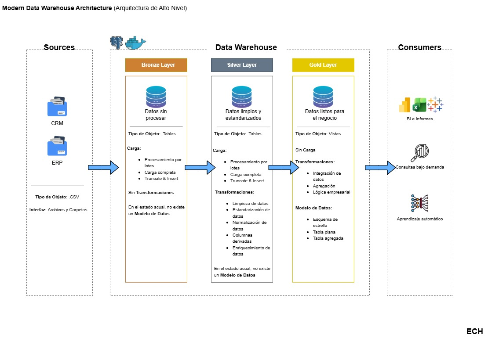
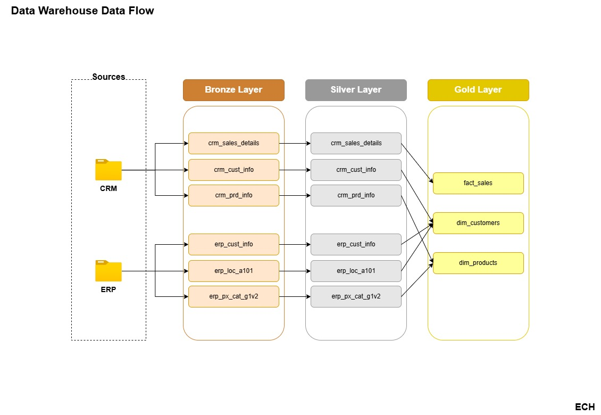
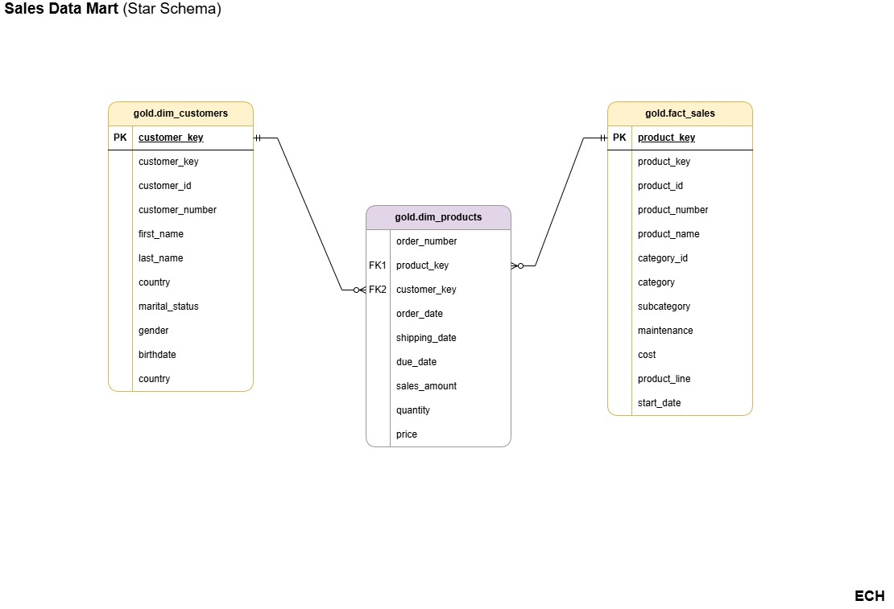

# SQL Data Warehouse Project


A modern Data Warehouse built with PostgreSQL following the Medallion Architecture (Bronze, Silver, and Gold).

This project demonstrates the end-to-end development of a modern Data Warehouse, including ETL processes, data cleansing, dimensional modeling, data quality validation, and technical documentation.

---

## 🚀 Current Progress

- ✅ High-Level Architecture
- ✅ Bronze Layer
- ✅ Silver Layer
- ✅ Gold Layer
- ✅ ETL Pipeline
- ✅ Star Schema (Sales Data Mart)
- ✅ Data Quality Checks
- ✅ Technical Documentation
- 🔄 Exploratory Data Analysis (EDA)
- 🔄 Advanced Data Analytics

---

# 📐 High-Level Architecture

This diagram provides an overview of the complete Medallion Architecture implemented in this project, showing the responsibilities of each layer and the final analytical outputs.

<p align="center">
  
</p>

---

# 🔄 Data Flow

The following diagram illustrates how data flows from the CRM and ERP source systems through the Bronze, Silver, and Gold layers until the dimensional model is created.

<p align="center">
  
</p>

---

# ⭐ Sales Data Mart

The Gold layer is modeled as a Star Schema composed of two dimensions and one fact table, optimized for reporting and analytical workloads.

<p align="center">
  
</p>

---

# 🛠 Technologies

- PostgreSQL
- SQL
- ETL
- Medallion Architecture
- Star Schema
- Data Warehouse
- Draw.io
- Git
- GitHub

---

# 📂 Project Structure

```text
sql-data-warehouse-project
│
├── datasets/
│
├── docs/
│   ├── data_architecture.jpg
│   ├── data_flow.jpg
│   ├── sales_data_mart.jpg
│   ├── data_catalog_en.md
│   └── data_catalog_es.md
│
├── scripts/
│   ├── bronze/
│   ├── silver/
│   └── gold/
│
├── tests/
│
└── README.md
```

---

# 📖 Documentation

- Data Warehouse Architecture
- Data Flow
- Sales Data Mart
- Data Catalog (English)
- Data Catalog (Spanish)
- Quality Checks

---

# 🎯 Next Steps

- Exploratory Data Analysis (EDA)
- Advanced Data Analytics
- Interactive Dashboards
