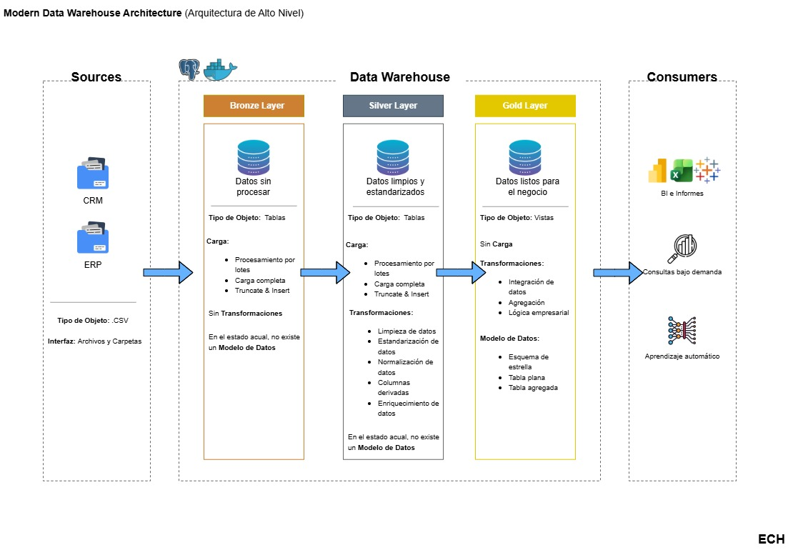
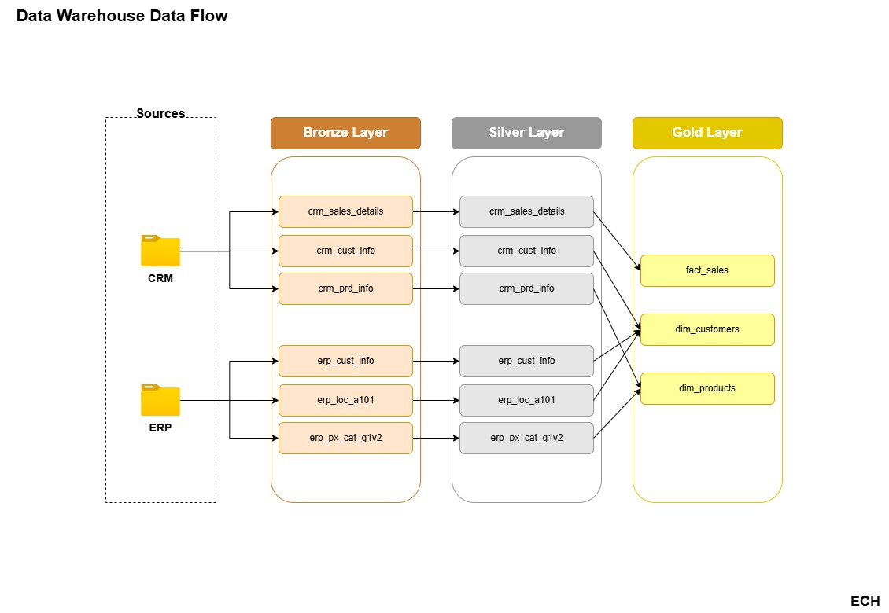
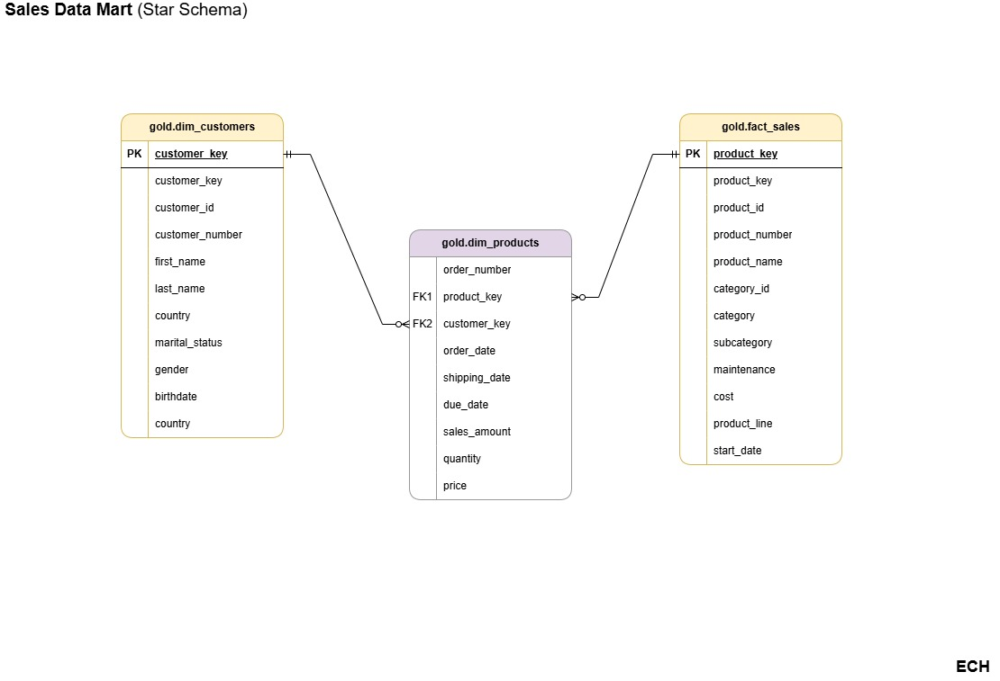
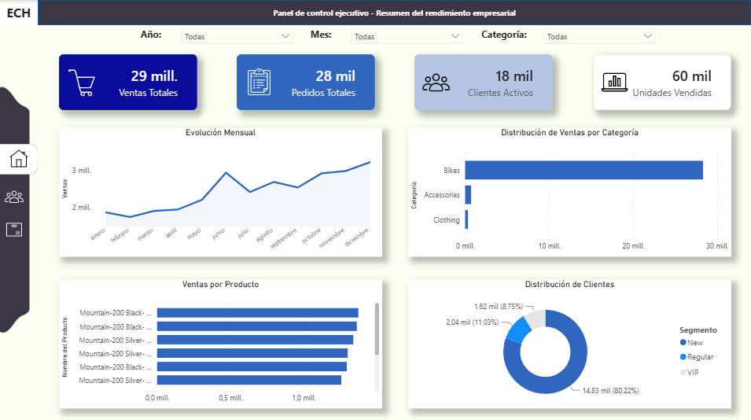
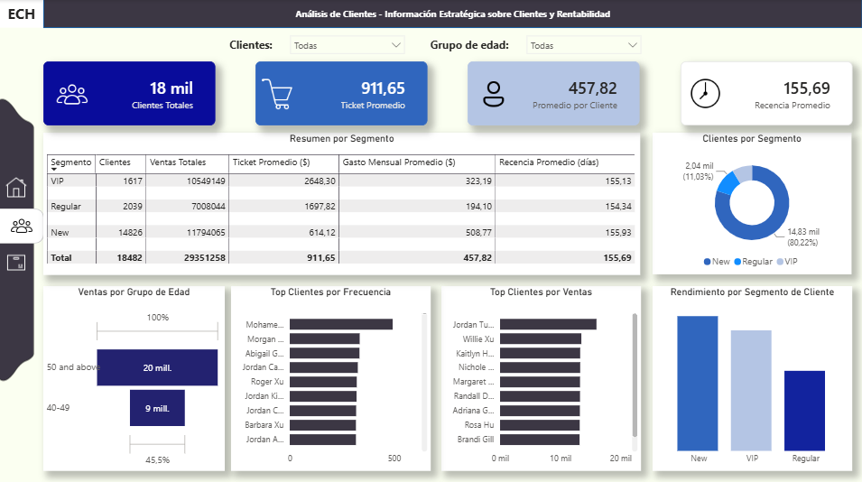
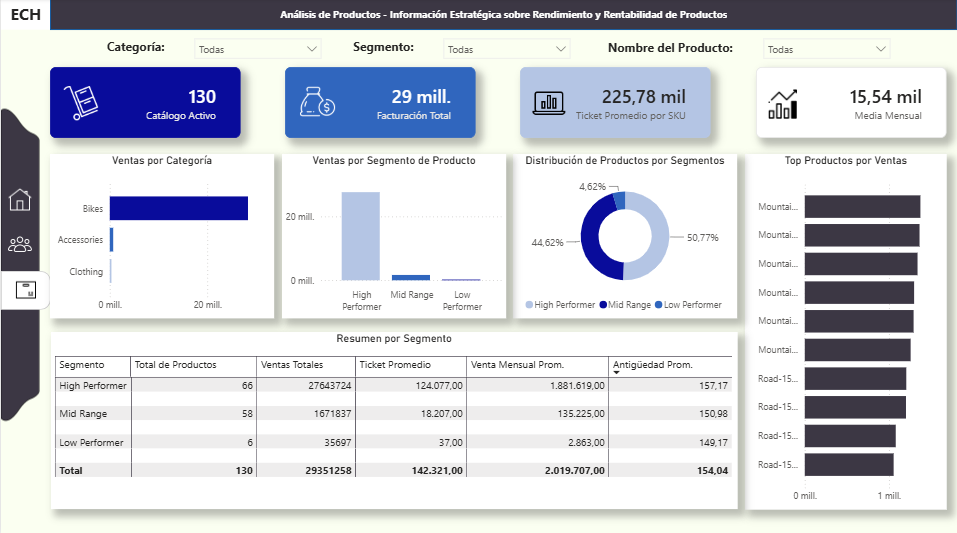

# SQL Data Warehouse & Business Intelligence Project


A complete end-to-end Data Engineering and Business Intelligence solution built with PostgreSQL and Power BI following the Medallion Architecture (Bronze, Silver, Gold).

This project demonstrates the full lifecycle of modern data analytics, including data ingestion, cleansing, transformation, dimensional modeling, business reporting, advanced analytics, and dashboard development.

---

# 🚀 Project Overview

The objective of this project is to transform raw CRM and ERP data into actionable business insights through a structured Data Warehouse and Business Intelligence environment.

The solution includes:

* Data ingestion from multiple source systems
* Data quality validation and cleansing
* Medallion Architecture implementation
* Dimensional modeling (Star Schema)
* Analytical reporting views
* Advanced SQL analytics
* Interactive Power BI dashboards
* Business performance monitoring

---

# ✅ Project Status

### Data Engineering

* ✅ Bronze Layer
* ✅ Silver Layer
* ✅ Gold Layer
* ✅ ETL Pipeline
* ✅ Data Cleansing
* ✅ Data Quality Validation
* ✅ Star Schema Modeling
* ✅ Technical Documentation

### Analytics

* ✅ Exploratory Data Analysis (EDA)
* ✅ Advanced SQL Analytics
* ✅ Customer Segmentation
* ✅ Product Performance Analysis
* ✅ Sales Trend Analysis
* ✅ Business KPI Development

### Business Intelligence

* ✅ Executive Dashboard
* ✅ Customer Analytics Dashboard
* ✅ Product Analytics Dashboard

---

# 📐 Data Warehouse Architecture

<p align="center">
  
</p>

---

# 🔄 Data Flow

<p align="center">
  
</p>

---

# ⭐ Sales Data Mart

<p align="center">
  
</p>

---

# 📊 Business Questions Answered

The analytical layer was designed to answer key business questions such as:

### Sales Performance

* How have sales evolved over time?
* What are the long-term sales trends?
* What is the cumulative revenue growth?

### Customer Analytics

* Who are the most valuable customers?
* Which customers belong to VIP, Regular, or New segments?
* Which customers have not purchased recently?
* What is the average customer spending behavior?

### Product Analytics

* Which products generate the highest revenue?
* Which categories contribute the most to total sales?
* Which products are high performers?
* Which products require business attention?

### Business Insights

* What percentage of revenue comes from each category?
* How does product performance compare to historical averages?
* Which business segments drive profitability?

---

# 📈 Power BI Dashboards

## Executive Dashboard

Provides a high-level overview of business performance.

<p align="center">
  
</p>

---

## Customer Analytics

Analyzes customer behavior, spending patterns, segmentation, and profitability.

<p align="center">
  
</p>

---

## Product Analytics

Evaluates product performance, revenue contribution, and category profitability.

<p align="center">
  
</p>

---

# 🛠 Technologies

### Data Engineering

* PostgreSQL
* SQL
* Docker
* pgAdmin

### Data Modeling

* Medallion Architecture
* Star Schema
* Data Warehouse Design

### Analytics

* Advanced SQL
* Window Functions
* CTEs
* Business KPI Development

### Business Intelligence

* Power BI
* DAX
* Power Query

### Documentation & Version Control

* Draw.io
* Git
* GitHub

---

# 📂 Project Structure

```text
sql-data-warehouse-project
│
├── datasets/
│
├── docs/
│   ├── data_architecture.jpg
│   ├── data_flow.jpg
│   ├── sales_data_mart.jpg
│   ├── executive_dashboard.png
│   ├── customer_analytics.png
│   ├── product_analytics.png
│   ├── data_catalog_en.md
│   └── data_catalog_es.md
│
├── scripts/
│   ├── bronze/
│   ├── silver/
│   └── gold/
│
├── tests/
│
└── README.md
```

---

# 🎯 Key Skills Demonstrated

* Data Engineering
* ETL Development
* Data Warehousing
* Data Modeling
* SQL Analytics
* Business Intelligence
* Dashboard Design
* KPI Development
* Data Quality Management
* Data Visualization

---

# 📜 License

This project is licensed under the MIT License.
